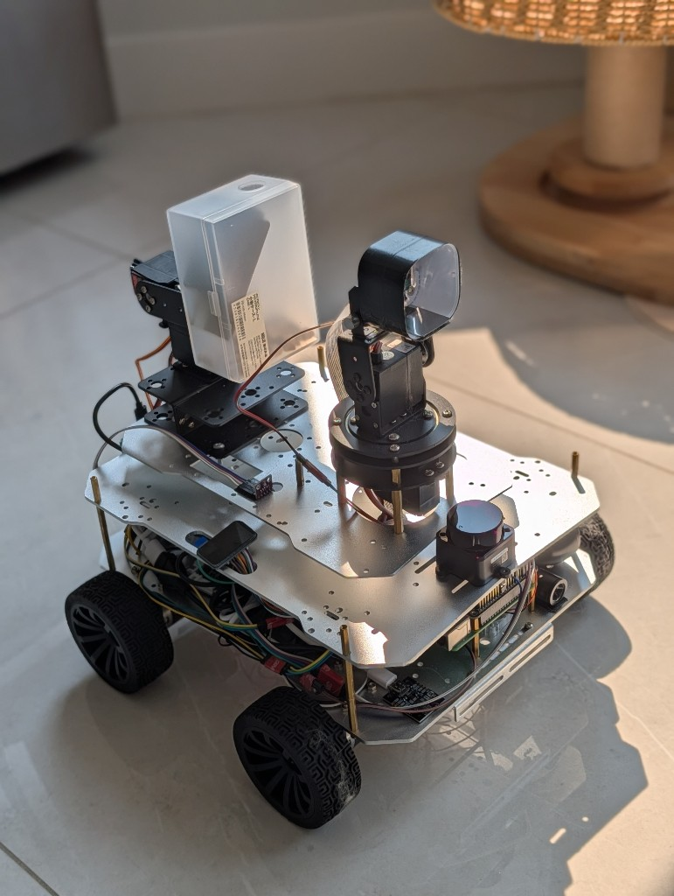
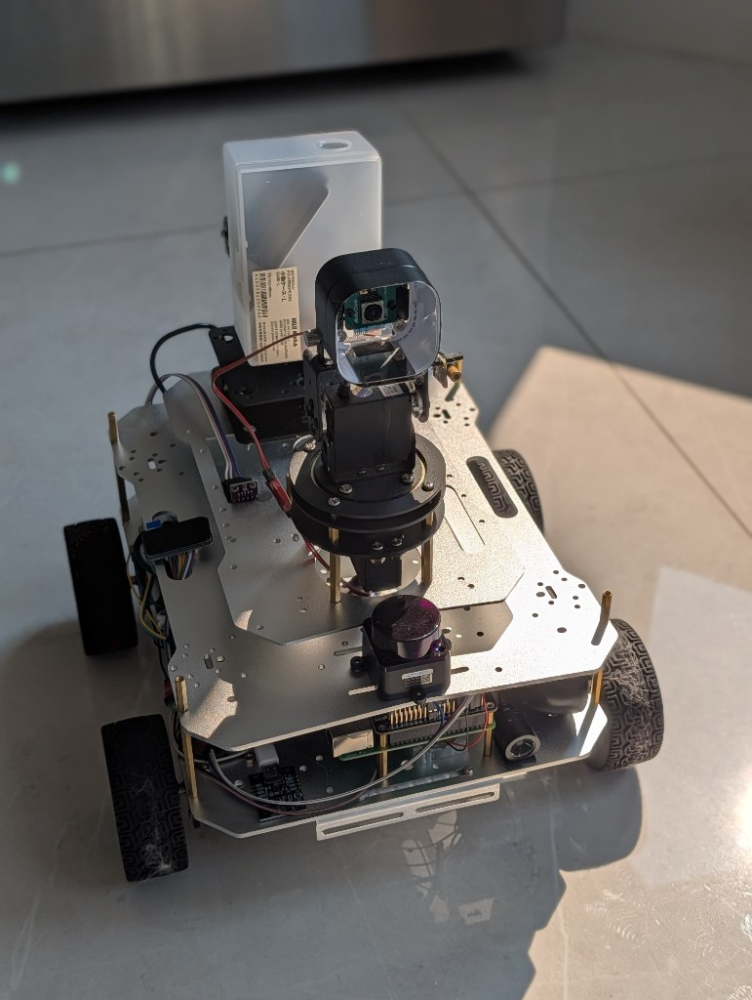
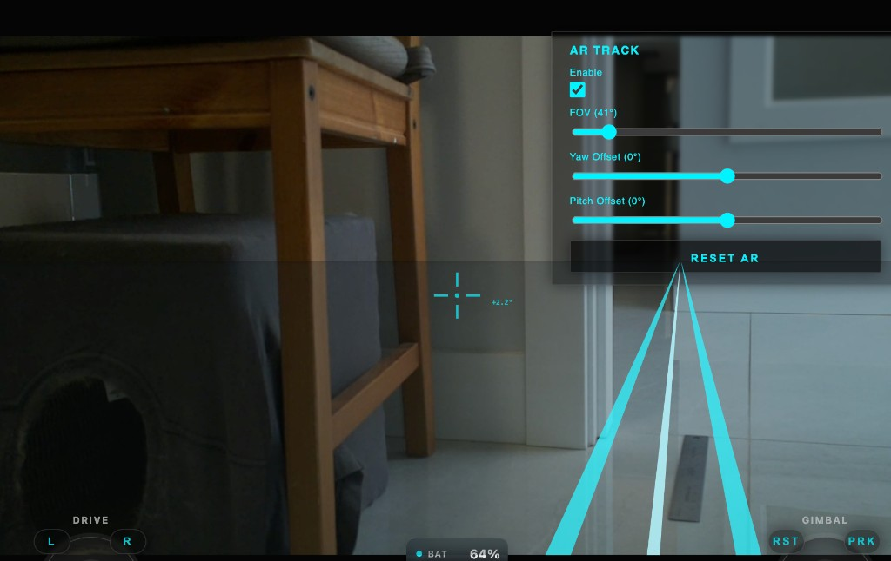

# Mango Mate

**A home rover, vibe-coded end to end.**

Aluminum chassis, live cockpit, and remote drive from across the city — a personal build that grew into a full rover system.

  

---

## Built on the floor. Wired by hand.

Stacked aluminum decks, brass standoffs, pan-tilt camera, front ranging, and a Pi tucked in the middle — the hardware is as much the project as the software.

  

---

## A cockpit that feels present

Keyboard, on-screen sticks, or Xbox. Live video, gimbal look, battery and link health, backup camera, and LiDAR when you need a map — all from a mission-style HUD.

  

---

## One system, three layers

| Layer | What it does |
| --- | --- |
| **Onboard** | Raspberry Pi — drive, camera, voice, sensors |
| **Edge cam** | ESP32 — backup stream and environment sense |
| **Relay** | Tailscale HTTPS hub — telemetry, distance, long-haul reach |

Repos: [mxl983/rover](https://github.com/mxl983/rover) (onboard) · [relay setup docs](docs/RELAY.md)

---

## Vibe coding, with wheels

Started as a weekend toy for the house. Turned into a remoteable rover you can steer from far away — messy wires, real latency, and all.

---

Mango Mate · a personal vibe-coding project
